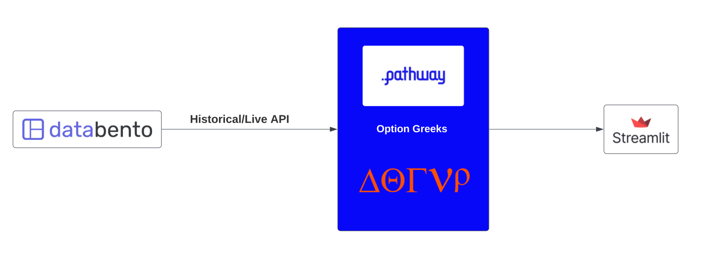
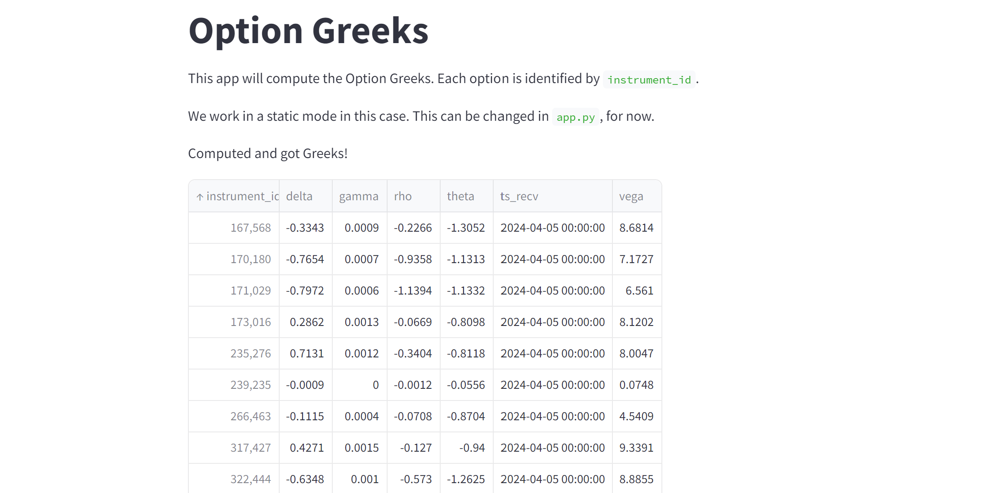

# Computing Option Greeks with Pathway and Databento.

This project aims at computing the Option Greeks using [Pathway](https://pathway.com/) and [Databento](https://databento.com/).
Pathway is a Python data processing framework for analytics and AI pipelines over data streams and Databento is a market data provider aiming at making access to institutional-grade financial data simpler and faster.

Options are financial derivatives that give the holder the right, but not the obligation, to buy or sell an underlying asset at a specified price within a certain period. 
The Option Greeks are metrics used to assess the sensitivity of option prices and provide detailed, quantifiable measures of various risk factors. Using Option Greeks, traders and risk managers make more informed, strategic decisions, enhancing their ability to manage risk and optimize returns.

The Option Greeks are computed by Pathway on the data obtained using Databento APIs.
The results are displayed in a Streamlit Dashboard.



You can learn more in our [dedicated article](https://pathway.com/developers/templates/option-greeks).

## Project organization

The sources of this project are organized as follows:

```
.
├── data/
│   ├── definition.csv
│   └── options.csv
├── .env
├── greeks-replay.py
├── greeks-static.py
├── requirements.txt
└── streamlit_ux.py
```

- `./data/`: the data used in the static script.
- `.env` is the file where you are going to enter your Databento API key and other parameters.
- `greeks-replay.py`: uses Databento historical API to read market data. The Option Greeks are computed using this data.
- `greeks-static.py`: same script but using the static data stored in CSV files.
- `requirements.txt`: is the requirements file which includes all libraries you need to download
- `streamlit_ux.py`: user interface using Streamlit to display the results using a dashboard.

## Running the project

### Installing the libraries

You need to install the required libraries for running both scripts. Run:

```
pip install -r requirements.txt
```

### Setup your API key

You need to generate a Databento API key first. You can [signup](https://databento.com/signup) and get free credits. Upon creating the account, you will receive the API key.

Now, in `.env`, set your API key. 

### Starting the UX

You start the UX in the same way, whatever code you want to run. To do so, run:
```
streamlit run streamlit_ux.py
```

This runs server at http://localhost:8501 and you should be able to open it and see some text. You could expect an error, as Streamlit is expecting data to be streamed, but that isn't done yet.

### Running your script

Run:
```
python greeks-replay.py
```
Give it a few seconds to startup, then the data will start being streamed. 
One way to check if it works, is to refresh the above page and see if a table being displayed, like below.


Note: since this is a `replay` mode, data will be streamed with delay, so try refreshing and see how the table grows in real time!

Another way, is to go to http://localhost:16001/get_table?alias=table_greeks and if you see a JSON with some values, that means it's working.
